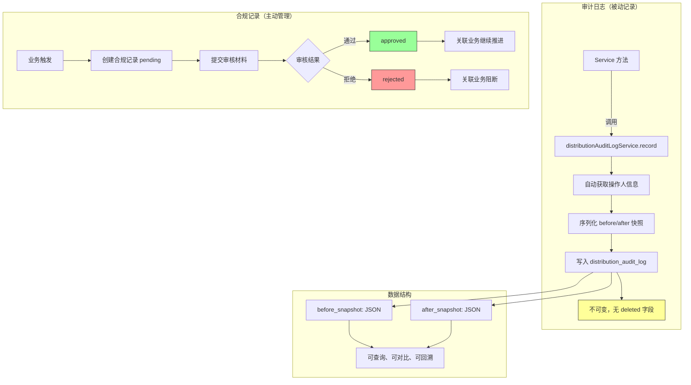

# Audit Snapshot: 审计日志与合规记录模式

> 用 JSON 快照记录每次数据变更的前后状态，配合统一的审计服务入口，实现零侵入的全链路操作追溯。

---

## 架构总览



---

## 问题描述

在受监管的业务系统中（医疗、金融、保险等），"谁在什么时候对什么数据做了什么修改"不仅是运维需求，更是合规要求。

传统的审计日志方案有两种：

1. **简单日志**：只记录"张三在 2026-06-15 修改了业务单 #1234" — **缺乏变更细节**
2. **数据库触发器**：通过 trigger 捕获变更 — **难以关联操作人上下文，且与业务逻辑脱节**

核心挑战是：
- 如何以最小的代码侵入记录完整的变更快照？
- 如何区分"正常业务操作"和"需要合规审查的操作"？
- 如何让审计日志既能高效写入，又能支持灵活的查询和回溯？

## 设计决策

### 决策 1：JSON 快照而非字段级 diff

每次变更记录变更前后的完整对象快照（JSON 序列化），而非记录"字段 A 从 X 变成 Y"。

```json
{
  "beforeSnapshot": {
    "id": 1234,
    "bizOrderNo": "DBO20260615143022",
    "status": "signed",
    "signedAmount": 50000,
    "receivedAmount": 0
  },
  "afterSnapshot": {
    "id": 1234,
    "bizOrderNo": "DBO20260615143022",
    "status": "first_paid",
    "signedAmount": 50000,
    "receivedAmount": 20000,
    "firstPaymentAt": "2026-06-15T14:35:00"
  }
}
```

**为什么用完整快照而非 diff？**
- **实现简单**：不需要编写 diff 算法，直接序列化对象即可
- **回溯方便**：可以还原任意时间点的数据状态
- **查询灵活**：可以用 JSON 函数查询特定字段的变更历史
- **存储成本可接受**：MySQL 的 `LONGTEXT` 类型 + 压缩后，单条记录通常在 1-5KB

**权衡**：存储空间换实现简洁性和查询灵活性。

### 决策 2：审计日志与合规记录分离

将"操作审计"和"合规审查"拆分为两张独立的表：

| 维度 | 审计日志 (`distribution_audit_log`) | 合规记录 (`distribution_compliance_record`) |
|------|----------------------------------|------------------------------------------|
| 用途 | 记录所有操作的变更历史 | 记录需要合规审查的业务行为 |
| 写入时机 | 每次写操作自动记录 | 业务触发时创建 |
| 内容 | before/after JSON 快照 | 合规内容 + 附件 + 审查结果 |
| 审查流程 | 无（纯记录） | 有待审 → 通过/驳回 流程 |
| 保留策略 | 按法规要求保留 N 年 | 按法规要求保留 N 年 |

**为什么分离？**
- 审计日志是"被动记录"，合规记录是"主动管理"
- 合规记录需要审批流程，审计日志不需要
- 合规记录需要关联附件（如资质文件、合同扫描件），审计日志不需要
- 查询模式不同：审计日志按操作查，合规记录按审查状态查

### 决策 3：审计服务作为统一入口

所有审计日志通过 `DistributionAuditLogService.record()` 一个方法写入，而非每个 Service 自己拼装日志对象。

```java
// 统一入口
distributionAuditLogService.record(
    bizType,          // 业务类型：business_order / commission / settlement / ...
    bizId,            // 业务对象 ID
    action,           // 操作：create / update / delete / event_xxx / lock / ...
    beforeSnapshot,   // 变更前的对象（可为 null，如创建操作）
    afterSnapshot,    // 变更后的对象（可为 null，如删除操作）
    remark            // 操作说明
);
```

**为什么统一入口？**
- 保证日志格式一致
- 操作人信息自动从上下文获取，不需要调用方传递
- 序列化逻辑集中在一处，便于优化（如字段脱敏、压缩）

### 决策 4：审计日志不使用 `deleted` 软删除

审计日志表没有 `deleted` 字段，一旦写入不可删除。这是审计日志区别于普通业务数据的关键设计。

```sql
CREATE TABLE distribution_audit_log (
  id BIGINT NOT NULL AUTO_INCREMENT,
  biz_type VARCHAR(32) NOT NULL,
  biz_id BIGINT NOT NULL,
  action VARCHAR(64) NOT NULL,
  before_snapshot LONGTEXT,
  after_snapshot LONGTEXT,
  operator_user_id BIGINT NOT NULL,
  operator_name VARCHAR(64),
  remark VARCHAR(500),
  create_time DATETIME NOT NULL DEFAULT CURRENT_TIMESTAMP,
  PRIMARY KEY (id),
  KEY idx_audit_log_biz_type_biz_id (biz_type, biz_id),
  KEY idx_audit_log_action (action),
  KEY idx_audit_log_create_time (create_time)
) ENGINE=InnoDB DEFAULT CHARSET=utf8mb4 COMMENT='审计日志表（不可删除）';
```

### 决策 5：业务类型枚举约束

`biz_type` 字段通过 `DistributionAuditBizType` 枚举约束合法值，防止拼写错误导致日志无法查询。

```java
public enum DistributionAuditBizType {
    DISTRIBUTOR("distributor"),           // 渠道
    MEMBER("member"),                     // 成员
    POLICY("policy"),                     // 政策
    LEAD("lead"),                         // 线索
    ATTRIBUTION("attribution"),           // 归因
    BUSINESS_ORDER("business_order"),     // 业务单
    COMMISSION("commission"),             // 佣金
    SETTLEMENT("settlement"),             // 结算
    COMPLIANCE("compliance"),             // 合规
    PRODUCT("product"),                   // 产品
    PRODUCT_LINE("product_line");         // 产品线
}
```

## 代码实现

### 整体架构

```
┌─────────────────────────────────────────────────────────────────────┐
│                        Service 层                                    │
│                                                                      │
│  任何写操作（create/update/delete/status_change/event/lock/...）     │
│       │                                                              │
│       │ 业务操作完成后调用                                           │
│       ▼                                                              │
│  distributionAuditLogService.record(                                │
│      bizType, bizId, action, beforeSnapshot, afterSnapshot, remark) │
│       │                                                              │
│       │ 自动获取操作人上下文                                         │
│       ▼                                                              │
│  DistributionAuditLogServiceImpl.record() {                         │
│      operator = getCurrentOperatorUser();                            │
│      entity.setBeforeSnapshot(objectMapper.writeValueAsString(o));  │
│      entity.setAfterSnapshot(objectMapper.writeValueAsString(n));   │
│      mapper.insertSelective(entity);                                │
│  }                                                                   │
└─────────────────────────────────────────────────────────────────────┘
```

### 核心代码：统一的审计记录方法

```java
// DistributionAuditLogServiceImpl.java

@Override
public void record(String bizType, Long bizId, String action,
                   Object beforeSnapshot, Object afterSnapshot, String remark) {
    // 1. 自动获取当前操作人（从 ThreadLocal）
    MedicalUserInfoEntity operator = distributionOperatorService.getCurrentOperatorUser();

    // 2. 构建审计日志实体
    DistributionAuditLogEntity entity = new DistributionAuditLogEntity();
    entity.setBizType(bizType);
    entity.setBizId(bizId);
    entity.setAction(action);
    entity.setBeforeSnapshot(writeSnapshot(beforeSnapshot));
    entity.setAfterSnapshot(writeSnapshot(afterSnapshot));
    entity.setOperatorUserId(operator.getId());
    entity.setOperatorName(operator.getName());
    entity.setRemark(remark);

    // 3. 写入数据库
    distributionAuditLogMapper.insertSelective(entity);
}

private String writeSnapshot(Object snapshot) {
    if (snapshot == null) return null;
    try {
        return objectMapper.writeValueAsString(snapshot);
    } catch (JsonProcessingException e) {
        throw new IllegalStateException("审计快照序列化失败", e);
    }
}
```

### 使用模式：Service 层的 4 种典型用法

**模式 1：创建操作**

```java
// 先执行业务操作
distributionBusinessOrderMapper.insertSelective(entity);

// 再记录审计日志（before = null，after = 新对象）
distributionAuditLogService.record(
    DistributionAuditBizType.BUSINESS_ORDER.getCode(),
    entity.getId(),
    "create",
    null,                           // 创建前无数据
    getBusinessOrder(entity.getId()), // 创建后的完整对象
    "创建分销业务单"
);
```

**模式 2：更新操作**

```java
// 先获取变更前的快照
DistributionBusinessOrderDetailDTO beforeSnapshot = getBusinessOrder(id);

// 执行更新
distributionBusinessOrderMapper.updateByPrimaryKeySelective(update);

// 记录审计日志（before = 旧对象，after = 新对象）
distributionAuditLogService.record(
    DistributionAuditBizType.BUSINESS_ORDER.getCode(),
    id,
    "update",
    beforeSnapshot,                 // 变更前
    getBusinessOrder(id),           // 变更后
    "更新分销业务单"
);
```

**模式 3：状态变更操作**

```java
// action 命名规范：event_ + 事件类型
distributionAuditLogService.record(
    DistributionAuditBizType.BUSINESS_ORDER.getCode(),
    businessOrderId,
    "event_" + eventType,           // 如 "event_signed", "event_first_payment"
    beforeSnapshot,
    getBusinessOrder(businessOrderId),
    "推进业务单事件：" + eventType
);
```

**模式 4：自动触发的级联操作**

```java
// 业务单取消时，自动删除归因，同时记录归因的审计日志
distributionAuditLogService.record(
    DistributionAuditBizType.ATTRIBUTION.getCode(),
    attribution.getId(),
    "delete",
    attribution,                    // 删除前的完整对象
    null,                           // 删除后无数据
    "业务单取消，自动删除归因"
);
```

### Action 命名规范

`action` 字段的命名遵循统一规范，便于查询和统计：

| 操作类型 | action 值 | 示例 |
|---------|----------|------|
| 创建 | `create` | `create` |
| 更新 | `update` | `update` |
| 删除（软删除） | `delete` | `delete` |
| 状态变更 | `event_` + 事件类型 | `event_signed`, `event_first_payment` |
| 审核操作 | `lock` / `approve` / `reject` | `lock`, `approve` |
| 冲回操作 | `reverse` / `create_reverse` | `reverse`, `create_hang_reverse` |
| 回款录入 | `record_receipt` | `record_receipt` |

### 查询接口

```java
// 按业务对象查询变更历史
PageResponseDTO<DistributionAuditLogDTO> listLogs(
    String bizType,     // 如 "business_order"
    Long bizId,         // 如 1234
    String action,      // 可选，如 "event_signed"
    Integer page,
    Integer pageSize
);

// 查看单条日志详情（含完整快照）
DistributionAuditLogDetailDTO getLog(Long id);
```

### 合规记录的设计

合规记录是审计日志的"升级版"，增加了审批流程和附件支持：

```java
// DistributionComplianceRecordEntity.java
public class DistributionComplianceRecordEntity {
    private Long id;
    private String bizType;           // 关联业务类型
    private Long bizId;               // 关联业务 ID
    private String productLineCode;   // 产品线
    private String recordType;        // 合规记录类型
    private String status;            // pending / approved / rejected
    private String content;           // 合规内容
    private String attachmentsJson;   // 附件 JSON（资质文件、合同扫描件等）
    private Long reviewedBy;          // 审查人
    private Date reviewedAt;          // 审查时间
    private String remark;
    // ... 审计字段
}
```

合规记录的生命周期：

```
  ┌─────────┐
  │ PENDING │  ← 创建合规记录
  └─────────┘
       │
       ├── approve ──► ┌──────────┐
       │               │ APPROVED │
       │               └──────────┘
       │
       └── reject ───► ┌──────────┐
                       │ REJECTED │
                       └──────────┘
```

## 适用场景

1. **受监管行业系统**：医疗、金融、保险等需要操作留痕的系统
2. **多租户 SaaS**：租户要求查看"谁改了什么"
3. **审批流系统**：审批前后需要快照对比
4. **数据恢复**：需要回溯到任意时间点的数据状态
5. **安全审计**：需要追踪异常操作（如频繁修改、越权访问）

### 适用条件

- 系统有明确的"操作人"概念（已登录用户）
- 数据变更是低频到中频的（每秒不超过几百次写入）
- 需要记录变更的完整上下文（而非只记录"发生了变更"）

### 不适用条件

- 高频写入场景（每秒数千次以上）：JSON 序列化 + 数据库写入会成为瓶颈
- 只需要计数/统计，不需要具体变更内容
- 数据量极大且无合规要求：审计日志的存储成本会很高

## 局限性

### 1. JSON 快照的存储成本

每次变更都记录完整的对象快照，如果对象字段很多（如业务单有 20+ 字段），单条日志可能达到数 KB。长期积累后，审计日志表可能成为数据库中最大的表。

**缓解方案**：
- 定期归档：将超过 N 个月的日志迁移到冷存储（如 OSS + Parquet）
- 字段裁剪：序列化时排除不重要的字段（如 `createTime`、`modifyTime`）
- 压缩存储：对 `LONGTEXT` 字段启用 MySQL 的行压缩（`ROW_FORMAT=COMPRESSED`）

### 2. 快照与实际数据的不一致

`beforeSnapshot` 是在业务操作前通过 `getXxx(id)` 查询获取的，`afterSnapshot` 是在业务操作后查询获取的。如果在两次查询之间有并发修改，快照可能与实际变更不完全一致。

**缓解方案**：
- 在同一个事务中获取 before 和 after 快照
- 对于高并发场景，考虑在 Entity 层面直接做快照（而非重新查询）

### 3. 查询性能

`biz_type` + `biz_id` 有联合索引，按业务对象查历史很快。但如果需要按"操作人查所有操作"或"按时间范围查所有变更"，需要额外的索引。

**建议索引**：
```sql
-- 按操作人查
ALTER TABLE distribution_audit_log ADD INDEX idx_audit_log_operator (operator_user_id, create_time);
-- 按时间范围查（已有）
-- idx_audit_log_create_time
```

### 4. 序列化失败的处理

`writeSnapshot()` 在序列化失败时抛出 `IllegalStateException`，这会导致整个业务操作回滚。对于审计日志这种"附属操作"，是否应该影响主业务流程是一个设计选择。

**当前选择**：审计失败 = 业务失败。这是保守策略，保证审计日志的完整性。

**替代方案**：审计失败时降级（如只记录 bizType + bizId + action，snapshot 记为 null），但这会导致审计数据不完整。

### 5. 脱敏问题

当前快照直接序列化完整对象，可能包含敏感信息（如患者手机号、身份证号）。审计日志本身也需要访问控制。

**改进方向**：
- 在 `writeSnapshot()` 中增加字段脱敏逻辑（如手机号中间 4 位打码）
- 或在 DTO 层面定义"审计视图"，排除敏感字段

### 6. 合规记录与审计日志的关联

当前两张表通过 `biz_type` + `biz_id` 松散关联，没有外键约束。如果需要"查看某个合规记录对应的所有操作历史"，需要通过业务逻辑拼接查询。

**改进方向**：在合规记录中增加 `audit_log_id` 字段，建立直接关联。

---

*本文档描述的模式在以下代码中实现：*
- *审计服务接口：`service/distribution/DistributionAuditLogService.java`*
- *审计服务实现：`service/distribution/impl/DistributionAuditLogServiceImpl.java`*
- *审计日志实体：`entity/distribution/DistributionAuditLogEntity.java`*
- *合规记录实体：`entity/distribution/DistributionComplianceRecordEntity.java`*
- *业务类型枚举：`enums/distribution/DistributionAuditBizType.java`*
- *审计日志 Mapper：`mapper/distribution/DistributionAuditLogEntityMapper.java` + XML*
