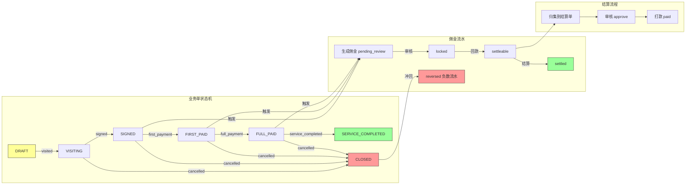

# Commission Pipeline: 佣金流转的状态机驱动流水线

中文 | [English](../en/architecture/commission-pipeline.md)

> 从线索到结算的全链路资金流转，通过事件驱动的状态机 + 规则快照 + 自动冲回机制，保证佣金计算的可追溯性和一致性。

---

## 架构总览



---

## 问题描述

分销系统的核心是"钱怎么分"。一个典型的佣金流转链路是：

```
渠道 A 的销售张三推荐了一位患者 → 患者签约 → 患者付款 → 服务完成 → 结算佣金
```

这个过程涉及多个业务实体的状态同步和资金计算：

1. **规则匹配**：不同产品、不同渠道等级、不同触发节点对应不同的佣金规则
2. **状态同步**：业务单状态变更时，线索阶段、归因状态需要联动更新
3. **资金一致性**：累计回款不能超过签约金额，佣金不能超过回款金额
4. **可追溯性**：每笔佣金必须能追溯到"是哪个事件触发的、按什么规则计算的"
5. **异常处理**：业务单取消/关闭时，已生成的佣金需要冲回

## 设计决策

### 决策 1：事件驱动而非状态驱动

业务单的状态变更通过"事件"推进，而非直接修改状态。每次状态变更都创建一条事件记录：

```java
// 不是直接改状态：
businessOrder.setStatus("signed");

// 而是通过事件推进：
createEvent(businessOrderId, eventType: "signed", eventAmount: 50000, eventTime: now());
// → 自动生成事件记录
// → 自动更新业务单状态
// → 自动生成佣金流水
// → 自动更新线索阶段
// → 自动记录审计日志
```

**原因**：
- 事件是不可变的，天然适合审计追溯
- 每个事件可以携带金额、时间等上下文信息
- 可以通过事件回放重建任意时间点的状态

### 决策 2：状态机硬编码而非配置化

业务单的状态转换规则硬编码在 `resolveAfterStatus()` 方法中，而非存储在数据库配置中。

```java
private String resolveAfterStatus(String currentStatus, String eventType) {
    if (DRAFT.equals(currentStatus)) {
        if (VISITED.equals(eventType)) return VISITING;
        if (SIGNED.equals(eventType)) return SIGNED;
        if (CANCELLED.equals(eventType)) return CANCELLED;
    }
    if (VISITING.equals(currentStatus)) {
        if (SIGNED.equals(eventType)) return SIGNED;
        if (CANCELLED.equals(eventType)) return CANCELLED;
    }
    // ... 更多状态转换规则
    throw new BizException("当前业务单状态不支持该事件");
}
```

**为什么硬编码？**
- 状态转换规则是业务核心逻辑，变更频率低
- 硬编码可以在编译期发现错误
- 每个转换可能伴随额外的副作用（如金额校验、时间戳更新），难以用通用配置表达
- 如果未来需要配置化，可以将这个方法替换为状态机引擎（如 Spring StateMachine）

### 决策 3：佣金规则快照而非引用

生成佣金流水时，将当时的规则信息以 JSON 快照的形式保存在流水记录中，而非只保存规则 ID。

```json
{
  "policyId": 101,
  "policyName": "基因检测分销政策 v2.0",
  "policyVersion": "v2.0.0",
  "ruleId": 55,
  "triggerNode": "first_payment",
  "ruleType": "rate",
  "commissionRate": 8.00,
  "fixedAmount": null,
  "channelLevelCode": "L1",
  "distributorLevelCode": "L1",
  "eventNo": "DBOE20260615143022-7821",
  "eventType": "first_payment"
}
```

**为什么快照而非引用？**
- 佣金政策会变更（如从 8% 调到 10%），但已生成的佣金应该按当时的规则计算
- 审计时需要知道"这笔佣金是按什么规则算出来的"，不需要再去查历史版本
- 结算时的争议仲裁依赖完整的规则上下文

### 决策 4：冲回而非删除

业务单取消/关闭时，已生成的佣金流水不删除，而是生成一条负数的"冲回流水"。

```java
// 原始流水：+5000
// 业务单取消后，生成冲回流水：-5000
DistributionCommissionLedgerEntity reverseEntity = new DistributionCommissionLedgerEntity();
reverseEntity.setCommissionAmount(ledger.getCommissionAmount().negate());  // 取负数
reverseEntity.setReverseLedgerId(ledger.getId());  // 关联原始流水
reverseEntity.setBizEventNo(eventNo + "-R-" + ledger.getId());  // 冲回事件号
```

**为什么冲回而非删除？**
- 已结算（已打款）的佣金不能直接删除，需要生成负数流水在下期抵扣
- 保留完整的资金流转链路，便于对账和审计
- 符合财务系统"红字冲销"的惯例

### 决策 5：两阶段冲回（已结算 vs 未结算）

冲回逻辑根据原始流水的状态分两种处理：

| 原始流水状态 | 冲回方式 | 说明 |
|------------|---------|------|
| `PENDING_REVIEW` / `LOCKED` | 直接标记为 `REVERSED` | 未结算，直接作废 |
| `SETTLED` | 生成负数流水 + 更新结算单 | 已打款，需要在下期抵扣 |

```java
if (SETTLED.equals(ledger.getStatus())) {
    // 已结算：生成负数挂账，待下期抵扣
    reverseEntity.setStatus(SETTLEABLE);
    markPaidSettlementReversed(ledger, reverseEntity, operatorUserId);
} else {
    // 未结算：直接标记冲回
    reverseEntity.setStatus(REVERSED);
    updateLedgerStatus(ledger.getId(), ..., REVERSED);
}
```

## 代码实现

### 全链路数据流

```
线索 (Lead)
  │
  │ 创建业务单时关联
  ▼
业务单 (Business Order)  ◄─── 业务单事件 (Business Order Event)
  │                              │
  │ 状态推进                     │ 触发
  │                              ▼
  │                         佣金流水 (Commission Ledger)
  │                              │
  │                              │ 录入回款
  │                              ▼
  │                         结算单 (Settlement)
  │                              │
  │                              │ 审批 → 打款
  │                              ▼
  └─────────────────────► 归因 (Attribution) 联动更新
```

### 状态机全景图

#### 业务单状态转换

```
                  ┌─────────────────────────────────────────────┐
                  │                                             │
                  ▼                                             │
  ┌───────┐   visited   ┌─────────┐   signed   ┌──────────┐   │
  │ DRAFT │────────────►│VISITING │───────────►│  SIGNED  │   │
  └───────┘             └─────────┘            └──────────┘   │
      │                     │                     │            │
      │ signed              │ signed              │ first_payment
      ├─────────────────────┼─────────────────────┤            │
      │                     │                     ▼            │
      │                     │               ┌───────────┐      │
      │                     │               │FIRST_PAID │      │
      │                     │               └───────────┘      │
      │                     │                     │            │
      │ cancelled           │ cancelled           │ full_payment
      ▼                     ▼                     ▼            │
  ┌───────────┐        ┌───────────┐        ┌──────────┐      │
  │CANCELLED  │        │CANCELLED  │        │ FULL_PAID│      │
  └───────────┘        └───────────┘        └──────────┘      │
                                                   │            │
                                                   │ service_completed
                                                   ▼            │
                                             ┌─────────────┐   │
                                             │  SERVICE_    │   │
                                             │  COMPLETED   │   │
                                             └─────────────┘   │
                                                   │            │
                                                   │ closed     │
                                                   ▼            │
                                             ┌──────────┐      │
                                             │  CLOSED  │──────┘
                                             └──────────┘
```

#### 佣金流水状态转换

```
  ┌──────────────────┐
  │  PENDING_REVIEW  │ (自动生成)
  └──────────────────┘
         │
         │ lock (审核通过)
         ▼
  ┌──────────────────┐
  │     LOCKED       │
  └──────────────────┘
         │
         │ record_receipt (录入回款)
         ▼
  ┌──────────────────┐
  │   SETTLEABLE     │─────► 自动生成结算单
  └──────────────────┘
         │
         │ (关联到结算单后)
         ▼
  ┌──────────────────┐
  │     SETTLED      │ (已结算/已打款)
  └──────────────────┘

  ┌──────────────────┐
  │     REVERSED     │ (未结算的冲回)
  └──────────────────┘

  ┌──────────────────┐
  │     VOIDED       │ (作废)
  └──────────────────┘
```

### 核心代码：佣金自动生成

当业务单事件发生时，自动触发佣金计算：

```java
// DistributionBusinessOrderServiceImpl.createEvent() 中：
distributionCommissionService.generateForBusinessOrderEvent(currentOrder, eventEntity);
```

```java
// DistributionCommissionService.java

public void generateForBusinessOrderEvent(DistributionBusinessOrderEntity businessOrder,
                                          DistributionBusinessOrderEventEntity event) {
    // 1. 冲回场景：业务单取消/关闭
    if (CANCELLED.equals(event.getEventType()) || CLOSED.equals(event.getEventType())) {
        reverseForBusinessOrderEvent(businessOrder, event);
        return;
    }

    // 2. 幂等检查：同一事件不重复生成佣金
    if (distributionCommissionLedgerMapper.selectByBizEventNo(event.getEventNo()) != null) {
        return;
    }

    // 3. 映射触发节点
    String triggerNode = resolveTriggerNode(event.getEventType());
    // SIGNED → "signed", FIRST_PAYMENT → "first_payment", FULL_PAYMENT → "full_payment"

    // 4. 查找匹配的佣金规则
    ResolvedCommission resolved = resolveCommission(businessOrder, event, distributor, triggerNode);

    // 5. 生成佣金流水
    DistributionCommissionLedgerEntity entity = new DistributionCommissionLedgerEntity();
    entity.setCommissionAmount(resolved.commissionAmount);
    entity.setCommissionRuleSnapshot(writeRuleSnapshot(policy, rule, distributor, event));
    entity.setStatus(PENDING_REVIEW);
    distributionCommissionLedgerMapper.insertSelective(entity);

    // 6. 记录审计日志
    distributionAuditLogService.record(COMMISSION, entity.getId(), "create", ...);
}
```

### 核心代码：规则匹配

```java
private ResolvedCommission resolveCommission(DistributionBusinessOrderEntity businessOrder,
                                             DistributionBusinessOrderEventEntity event,
                                             DistributionDistributorEntity distributor,
                                             String triggerNode) {
    // 1. 查找该产品当前生效的所有政策
    List<DistributionProductPolicyEntity> policies =
        distributionProductPolicyMapper.selectActiveByProductId(
            businessOrder.getProductId(), event.getEventTime());

    // 2. 遍历政策，找到第一个匹配的规则
    for (DistributionProductPolicyEntity policy : policies) {
        List<DistributionProductPolicyRuleEntity> rules =
            distributionProductPolicyRuleMapper.selectByPolicyId(policy.getId());

        // 3. 按触发节点 + 渠道等级筛选规则
        DistributionProductPolicyRuleEntity rule =
            pickRule(rules, triggerNode, distributor.getLevelCode());

        // 4. 计算佣金金额
        BigDecimal amount = calculateCommissionAmount(rule, businessOrder, event);
        if (amount != null && amount.compareTo(BigDecimal.ZERO) > 0) {
            return new ResolvedCommission(policy, rule, amount);
        }
    }
    return null;  // 无匹配规则，不生成佣金
}

private BigDecimal calculateCommissionAmount(DistributionProductPolicyRuleEntity rule,
                                             DistributionBusinessOrderEntity businessOrder,
                                             DistributionBusinessOrderEventEntity event) {
    // 固定金额模式
    if (FIXED.equals(rule.getRuleType())) {
        return rule.getFixedAmount();
    }
    // 比例模式：基础金额 × 佣金比例
    if (RATE.equals(rule.getRuleType())) {
        BigDecimal baseAmount = resolveBaseAmount(businessOrder, event);
        return baseAmount.multiply(rule.getCommissionRate())
            .divide(new BigDecimal("100"), 2, RoundingMode.HALF_UP);
    }
    return null;
}
```

### 核心代码：冲回机制

```java
private void reverseForBusinessOrderEvent(DistributionBusinessOrderEntity businessOrder,
                                          DistributionBusinessOrderEventEntity event) {
    // 1. 查找该业务单的所有佣金流水
    List<DistributionCommissionLedgerEntity> ledgers =
        distributionCommissionLedgerMapper.selectByBizOrderId(businessOrder.getId());

    for (DistributionCommissionLedgerEntity ledger : ledgers) {
        // 2. 跳过已冲回的流水
        if (!shouldReverseLedger(ledger)) continue;

        // 3. 幂等检查
        String reverseBizEventNo = event.getEventNo() + "-R-" + ledger.getId();
        if (distributionCommissionLedgerMapper.selectByBizEventNo(reverseBizEventNo) != null) continue;

        // 4. 生成负数冲回流水
        DistributionCommissionLedgerEntity reverseEntity = new DistributionCommissionLedgerEntity();
        reverseEntity.setCommissionAmount(ledger.getCommissionAmount().negate());
        reverseEntity.setReverseLedgerId(ledger.getId());
        reverseEntity.setBizEventNo(reverseBizEventNo);

        // 5. 根据原始流水状态决定冲回方式
        if (SETTLED.equals(ledger.getStatus())) {
            // 已打款：生成负数挂账，更新结算单
            reverseEntity.setStatus(SETTLEABLE);
            markPaidSettlementReversed(ledger, reverseEntity, operatorUserId);
        } else {
            // 未打款：直接标记冲回
            reverseEntity.setStatus(REVERSED);
            updateLedgerStatus(ledger.getId(), ..., REVERSED);
        }
    }
}
```

### 核心代码：状态推进时的副作用联动

业务单事件推进时，除了更新业务单状态，还会触发多个联动操作：

```java
// DistributionBusinessOrderServiceImpl.createEvent() 中：

// 1. 更新业务单状态和时间戳
applyEventMutation(update, existing, eventType, request);

// 2. 自动生成佣金流水
distributionCommissionService.generateForBusinessOrderEvent(currentOrder, eventEntity);

// 3. 业务单取消/关闭时，自动删除归因
deleteAttributionWhenBusinessOrderClosed(currentOrder, eventType, operatorUserId);

// 4. 联动更新线索阶段
updateLeadStageWhenBusinessOrderStatusChanged(currentOrder, afterStatus, operatorUserId);

// 5. 自动创建线索跟进记录
createLeadFollowUpForBusinessOrderEvent(currentOrder, eventEntity, operatorUserId);

// 6. 记录审计日志
distributionAuditLogService.record(BUSINESS_ORDER, id, "event_" + eventType, ...);
```

### 结算单的生命周期

```
佣金流水 SETTLEABLE
       │
       │ createSettlement (按渠道+时间段批量归集)
       ▼
  ┌──────────┐   approve   ┌──────────┐   pay   ┌──────────┐
  │ PENDING  │────────────►│ APPROVED │────────►│   PAID   │
  └──────────┘             └──────────┘         └──────────┘
       │
       │ reject
       ▼
  ┌──────────┐
  │ REJECTED │
  └──────────┘
```

## 适用场景

1. **分销佣金系统**：渠道佣金的计算、审核、结算
2. **订单分润系统**：多方参与的订单收益分配
3. **绩效提成系统**：销售提成的阶梯计算和发放
4. **任何涉及"事件→规则匹配→金额计算→审核→打款"的资金流转场景**

### 适用条件

- 佣金规则可以在运行时配置（产品 × 渠道等级 × 触发节点）
- 资金流转需要完整的审计链路
- 需要支持"已打款后冲回"的场景

### 不适用条件

- 佣金规则极其复杂（如需要多级分润、团队裂变等），可能需要专用的规则引擎
- 实时结算（如每笔交易即时到账），本模式偏向批量结算
- 涉及外部支付渠道的直接对接

## 局限性

### 1. 状态机硬编码的维护成本

所有状态转换规则集中在 `resolveAfterStatus()` 方法中。当业务单状态和事件类型增加时，这个方法会变得很长且容易出错。

**改进方向**：
- 引入状态转换矩阵（二维数组或 Map）
- 或使用 Spring StateMachine 框架

### 2. 佣金计算的 N+1 查询

`resolveCommission()` 方法中，先查政策列表，再遍历政策查规则列表，存在 N+1 查询问题。

**改进方向**：
- 批量查询：一次查出产品关联的所有政策及其规则
- 缓存：对活跃的佣金政策做本地缓存

### 3. 冲回的级联复杂度

已结算佣金的冲回需要同时更新：原始流水状态 → 冲回流水 → 结算单 `reversedAmount` → 结算单 `actualAmount` → 结算明细状态。这个级联操作虽然在同一个事务中，但逻辑复杂，容易遗漏边界情况。

### 4. 结算单的粒度

当前实现中，录入回款时自动生成"单笔结算单"，也支持按渠道+时间段批量创建。两种方式并存增加了理解成本。

**建议**：统一为批量结算模式，取消自动生成单笔结算单的逻辑。

### 5. 缺少佣金预估

当前只有在事件实际发生后才计算佣金。缺少"如果客户签约 50000 元，销售能拿多少佣金"的预估能力。

**改进方向**：新增 `estimateCommission(productId, amount, distributorLevel)` 接口，复用规则匹配逻辑但不落库。

---

*本文档描述的模式在以下代码中实现：*
- *业务单服务：`service/distribution/impl/DistributionBusinessOrderServiceImpl.java`*
- *佣金服务：`service/distribution/impl/DistributionCommissionServiceImpl.java`*
- *结算服务：`service/distribution/impl/DistributionSettlementServiceImpl.java`*
- *触发节点枚举：`enums/distribution/DistributionTriggerNode.java`*
- *规则类型枚举：`enums/distribution/DistributionRuleType.java`*
- *佣金模式枚举：`enums/distribution/DistributionCommissionMode.java`*
