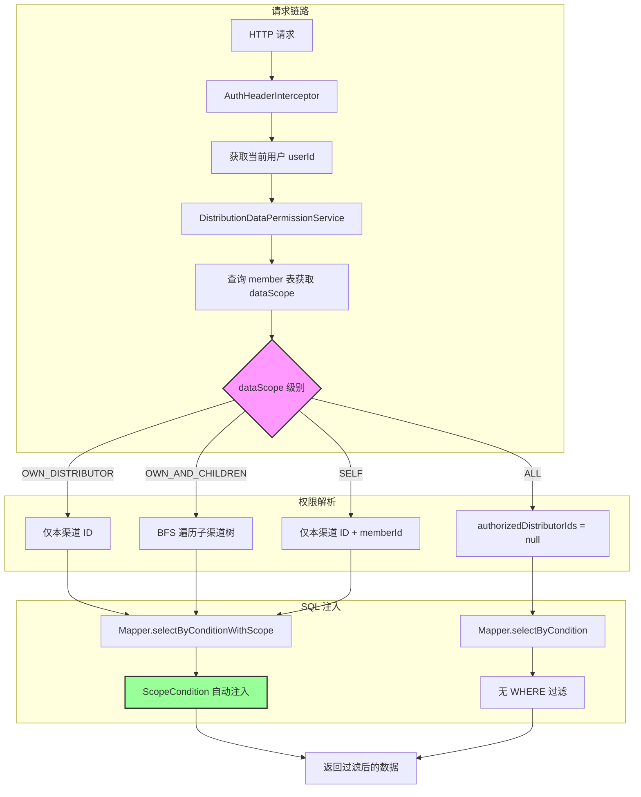

# Scoped Data Access: 行级数据权限模型

中文 | [English](../en/architecture/data-permission-model.md)

> 基于角色的数据范围控制，将权限校验下沉到 SQL 层，实现零业务代码侵入的行级数据过滤。

---

## 架构总览



---

## 问题描述

在 B2B 管理系统中，不同角色的用户对数据的可见范围有严格要求。以分销系统为例：

| 角色 | 应看到的数据 |
|------|------------|
| 超级管理员 | 所有渠道的所有线索、业务单、佣金 |
| 渠道经理 | 本渠道及下级渠道的数据 |
| 销售 | 仅自己负责的线索和业务单 |
| 财务 | 所有渠道的财务数据，但不能看线索详情 |

传统的做法是在每个查询接口中手动拼接 `WHERE` 条件，这种方式存在三个问题：

1. **遗漏风险**：新增查询接口时容易忘记加权限过滤
2. **代码重复**：相同的权限过滤逻辑散布在几十个 Service 方法中
3. **维护成本**：权限规则变更时需要修改所有相关接口

## 设计决策

### 决策 1：权限信息存储在成员表上，而非用户表

将 `data_scope` 和 `role_code` 字段放在 `distribution_distributor_member` 表上，而非 `admin_user` 表上。

```
admin_user (系统用户)
    └── distribution_distributor_member (分销成员) ← data_scope, role_code 在这里
            └── distribution_distributor (所属渠道)
```

**原因**：同一个系统用户在不同渠道中可能有不同角色。例如张三在 A 渠道是销售（`SELF`），在 B 渠道可能是经理（`OWN_DISTRIBUTOR`）。如果放在用户表上，就无法表达这种多渠道多角色的场景。

### 决策 2：用 4 个枚举值覆盖所有场景

```java
public enum DistributionDataScope {
    ALL("ALL"),                        // 全部数据
    OWN_DISTRIBUTOR("OWN_DISTRIBUTOR"), // 所属渠道数据
    OWN_AND_CHILDREN("OWN_AND_CHILDREN"), // 所属渠道 + 下级渠道数据
    SELF("SELF");                       // 仅本人数据
}
```

**为什么不做成可配置的任意层级？** 因为 4 级已经覆盖了 95% 的 B2B 场景。过度灵活会增加理解成本和测试复杂度。

### 决策 3：权限解析结果缓存为不可变对象

`DistributionDataAccessScope` 是一个不可变的值对象，解析后通过方法参数传递，不存储在 ThreadLocal 中。

```java
public static final class DistributionDataAccessScope {
    private final Long operatorUserId;
    private final Long memberId;
    private final Long distributorId;
    private final String roleCode;
    private final String dataScope;
    private final List<Long> authorizedDistributorIds;  // 不可变 List

    // 没有 setter，所有字段通过构造函数设置
}
```

**为什么不用 ThreadLocal？** 虽然更方便，但会带来三个问题：
- 请求结束后必须手动清理，否则内存泄漏
- 异步线程中拿不到上下文
- 单元测试需要额外的 setup/teardown

### 决策 4：在 SQL 层而非 Java 层做过滤

通过 MyBatis 的 `<sql>` 片段将权限条件注入到 SQL 中，而非查询全量数据后在 Java 层过滤。

```xml
<sql id="ScopeCondition">
    <if test="authorizedDistributorIds != null and authorizedDistributorIds.size() > 0">
        and distributor_id in
        <foreach collection="authorizedDistributorIds" item="id" open="(" separator="," close=")">
            #{id}
        </foreach>
    </if>
    <if test="authorizedMemberId != null or authorizedOwnerUserId != null">
        and (
        <if test="authorizedMemberId != null">
            member_id = #{authorizedMemberId}
        </if>
        <if test="authorizedMemberId != null and authorizedOwnerUserId != null">
            or
        </if>
        <if test="authorizedOwnerUserId != null">
            owner_user_id = #{authorizedOwnerUserId}
        </if>
        )
    </if>
</sql>
```

**为什么在 SQL 层做？**
- 性能：数据库过滤后再返回，避免传输无权限数据
- 安全：Java 层过滤可能被遗漏，SQL 层通过统一的 `<include>` 强制注入
- 简洁：Service 层不需要关心过滤逻辑

## 代码实现

### 整体架构

```
┌─────────────────────────────────────────────────────────────────┐
│                        Controller 层                             │
│  @SessionAuth → 解析 Token → ThreadLocal userId                │
└──────────────────────────────┬──────────────────────────────────┘
                               │
┌──────────────────────────────▼──────────────────────────────────┐
│                        Service 层                                │
│                                                                  │
│  1. resolveCurrentAccessScope()                                  │
│     → 查 member 表 → 读 roleCode + dataScope                    │
│     → resolveAuthorizedDistributorIds()                          │
│     → 返回 DistributionDataAccessScope (不可变对象)              │
│                                                                  │
│  2. checkAccessPermission(distributorId, memberId, ownerUserId)  │
│     → ALL: 直接通过                                              │
│     → SELF: 检查 memberId 或 ownerUserId 是否匹配               │
│     → OWN_DISTRIBUTOR / OWN_AND_CHILDREN:                       │
│       检查 distributorId 是否在 authorizedDistributorIds 中     │
└──────────────────────────────┬──────────────────────────────────┘
                               │
┌──────────────────────────────▼──────────────────────────────────┐
│                        Mapper 层                                 │
│                                                                  │
│  <select id="selectByConditionWithScope">                        │
│    SELECT ... FROM table                                         │
│    <include refid="ConditionWhere"/>    ← 业务过滤条件           │
│    <include refid="ScopeCondition"/>    ← 权限过滤条件 (自动注入)│
│  </select>                                                       │
└─────────────────────────────────────────────────────────────────┘
```

### 核心代码：权限解析

```java
// DistributionDataPermissionService.java

public DistributionDataAccessScope resolveCurrentAccessScope() {
    // 1. 获取当前操作人
    Long operatorUserId = distributionOperatorService.getCurrentOperatorUserId();
    DistributionDistributorMemberEntity currentMember =
        distributionDistributorMemberMapper.selectByUserId(operatorUserId);

    // 2. 校验角色和数据范围
    String roleCode = currentMember.getRoleCode();
    String dataScope = currentMember.getDataScope();

    // 3. 解析可访问的渠道 ID 列表
    List<Long> authorizedDistributorIds =
        resolveAuthorizedDistributorIds(currentMember.getDistributorId(), dataScope);

    // 4. 构建不可变的权限范围对象
    return new DistributionDataAccessScope(
        operatorUserId, currentMember.getId(),
        currentMember.getDistributorId(), roleCode,
        dataScope, authorizedDistributorIds
    );
}
```

### 核心代码：渠道树递归遍历

```java
private List<Long> resolveAuthorizedDistributorIds(Long distributorId, String dataScope) {
    // ALL: 返回 null 表示不限制
    if (DistributionDataScope.ALL.getCode().equals(dataScope)) {
        return null;
    }
    // SELF: 不需要渠道 ID 列表（用 memberId 过滤）
    if (distributorId == null) {
        return Collections.emptyList();
    }

    LinkedHashSet<Long> authorizedIds = new LinkedHashSet<>();
    authorizedIds.add(distributorId);

    // OWN_DISTRIBUTOR: 只返回自己
    if (!DistributionDataScope.OWN_AND_CHILDREN.getCode().equals(dataScope)) {
        return new ArrayList<>(authorizedIds);
    }

    // OWN_AND_CHILDREN: BFS 遍历子渠道树
    List<Long> parentIds = Collections.singletonList(distributorId);
    while (!parentIds.isEmpty()) {
        List<DistributionDistributorEntity> children =
            distributionDistributorMapper.selectByParentIds(parentIds);
        if (children == null || children.isEmpty()) break;

        List<Long> nextParentIds = new ArrayList<>();
        for (DistributionDistributorEntity child : children) {
            if (authorizedIds.add(child.getId())) {  // 去重
                nextParentIds.add(child.getId());
            }
        }
        parentIds = nextParentIds;
    }
    return new ArrayList<>(authorizedIds);
}
```

### 核心代码：权限校验

```java
public void checkAccessPermission(Long distributorId, Long memberId, Long ownerUserId) {
    DistributionDataAccessScope scope = resolveCurrentAccessScope();

    // ALL: 直接通过
    if (scope.isAllScope()) return;

    // SELF: 只能访问自己的数据
    if (scope.isSelfScope()) {
        boolean matched = false;
        if (memberId != null && scope.getMemberId().equals(memberId)) matched = true;
        if (ownerUserId != null && scope.getOperatorUserId().equals(ownerUserId)) matched = true;
        if (!matched) throw new BizException("无权访问该数据", ...);
        return;
    }

    // OWN_DISTRIBUTOR / OWN_AND_CHILDREN: 检查渠道是否在授权范围内
    List<Long> authorizedIds = scope.getAuthorizedDistributorIds();
    if (authorizedIds == null || authorizedIds.isEmpty()
        || !authorizedIds.contains(distributorId)) {
        throw new BizException("无权访问该数据", ...);
    }
}
```

### 使用方式：Service 层两种用法

**用法 1：列表查询 — 传入 ScopeCondition 参数**

```java
// DistributionBusinessOrderServiceImpl.java

public PageResponseDTO<DistributionBusinessOrderDTO> listBusinessOrders(...) {
    DistributionDataAccessScope accessScope =
        distributionDataPermissionService.resolveCurrentAccessScope();

    // 根据数据范围决定 SQL 参数
    List<Long> authorizedDistributorIds = accessScope.isAllScope() || accessScope.isSelfScope()
        ? null : accessScope.getAuthorizedDistributorIds();
    Long authorizedMemberId = accessScope.isSelfScope() ? accessScope.getMemberId() : null;
    Long authorizedOwnerUserId = accessScope.isSelfScope() ? accessScope.getOperatorUserId() : null;

    // 查询时自动注入权限条件
    long total = distributionBusinessOrderMapper.countByConditionWithScope(
        ..., authorizedDistributorIds, authorizedMemberId, authorizedOwnerUserId);
    List<...> entities = distributionBusinessOrderMapper.selectByConditionWithScope(
        ..., authorizedDistributorIds, authorizedMemberId, authorizedOwnerUserId, offset, limit);
}
```

**用法 2：详情查询 — 校验单条记录的访问权限**

```java
// 获取并校验单条记录
DistributionBusinessOrderEntity entity = getBusinessOrderEntity(id);
distributionDataPermissionService.checkAccessPermission(
    entity.getDistributorId(), entity.getMemberId(), entity.getCurrentOwnerUserId());
```

### Mapper XML 的对偶设计

每个需要权限控制的 Mapper 都提供两套查询方法：

| 方法 | 用途 | 是否带权限过滤 |
|------|------|--------------|
| `selectByCondition` | 内部调用、管理员查询 | ❌ |
| `selectByConditionWithScope` | 普通用户查询 | ✅ |
| `countByCondition` | 内部计数 | ❌ |
| `countByConditionWithScope` | 普通用户计数 | ✅ |

这种对偶设计保证了内部服务调用（如定时任务、数据迁移）可以绕过权限限制，而面向用户的接口强制走权限过滤。

## 适用场景

这个模式适用于以下场景：

1. **多租户 SaaS 系统**：不同租户只能看到自己的数据
2. **集团-分公司-部门层级结构**：上级可以看到下级的数据
3. **CRM / 分销系统**：销售人员只能看到自己负责的客户
4. **任何需要"按角色控制数据行可见范围"的系统**

### 适用条件

- 数据有明确的归属关系（归属于某个组织/部门/人）
- 权限维度相对固定（如组织层级、人员归属）
- 查询频率高，需要在数据库层面高效过滤

### 不适用条件

- 权限维度极其灵活（如基于 ABAC 的任意属性组合）
- 数据无明确归属（如公共知识库）
- 需要列级权限控制（本模式只解决行级）

## 局限性

### 1. 渠道树深度影响性能

`OWN_AND_CHILDREN` 通过递归 SQL 查询遍历子渠道树。如果渠道层级很深（如 5 层以上）且每层渠道数量很多，生成的 `IN (...)` 列表可能很长。

**缓解方案**：
- 限制渠道树的最大深度（业务层面约束）
- 对 `authorizedDistributorIds` 做缓存（如 Redis，TTL 5 分钟）
- 考虑使用 `path` 字段（如 `1/5/23/`）配合 `LIKE '1/5/%'` 替代递归查询

### 2. SELF 范围的查询性能

`SELF` 范围需要同时检查 `member_id` 和 `owner_user_id` 两个字段，生成的 SQL 条件是 `OR`：

```sql
AND (member_id = #{authorizedMemberId} OR owner_user_id = #{authorizedOwnerUserId})
```

如果表数据量大，这个 `OR` 条件可能导致索引失效。

**缓解方案**：
- 确保 `member_id` 和 `owner_user_id` 都有独立索引
- 如果性能仍不足，考虑拆成两个查询后合并

### 3. 权限变更的生效延迟

权限信息存储在 `distribution_distributor_member` 表中，修改后立即生效。但如果使用了缓存（如 `authorizedDistributorIds` 的 Redis 缓存），需要在成员权限变更时主动清除缓存。

### 4. 不支持列级权限

本模式只解决"哪些行可见"的问题，不解决"某些字段对某些角色不可见"。如果需要列级权限（如销售看不到成本价），需要额外实现。

### 5. 跨渠道数据的归属问题

当一条数据涉及多个渠道时（如渠道 A 的线索被转让给渠道 B），`distributor_id` 只能记录一个归属。当前设计通过 `owner_user_id` 做了部分补充，但复杂的多渠道协作场景可能需要更细粒度的权限模型。

---

## 可复用实现

本文档描述的"数据权限下沉到 SQL 层"模式，已抽象为独立的 Spring Boot Starter 库，可直接导入使用：

📦 **[spring-data-permission-starter](https://github.com/StevenTsai/spring-data-permission-starter)**

| 对比 | 本文档（distribution-starter） | Starter 库 |
|------|-------------------------------|-----------|
| 定位 | 教学示例，展示完整实现 | 生产可用的可复用库 |
| 数据范围 | 4 级（ALL / OWN_DISTRIBUTOR / OWN_AND_CHILDREN / SELF） | 4 标准范围 + 扩展点 |
| 权限上下文 | `DistributionDataAccessScope` 不可变对象 | `DataPermissionContext` + Builder |
| SQL 注入 | 手动传参 + `<include refid="ScopeCondition"/>` | `DataPermissionHelper` 自动补齐参数 |
| 使用方式 | 参考代码自行实现 | Maven 依赖引入即可 |

> 如果你想直接在项目中使用数据权限能力，推荐使用 Starter 库；如果你想理解"为什么这样设计"，本文档是完整的设计思路。

---

*本文档描述的模式在以下代码中实现：*
- *核心逻辑：`service/distribution/impl/DistributionDataPermissionService.java`*
- *数据范围枚举：`enums/distribution/DistributionDataScope.java`*
- *角色枚举：`enums/distribution/DistributionRoleCode.java`*
- *SQL 片段：各 Mapper XML 中的 `ScopeCondition`*
