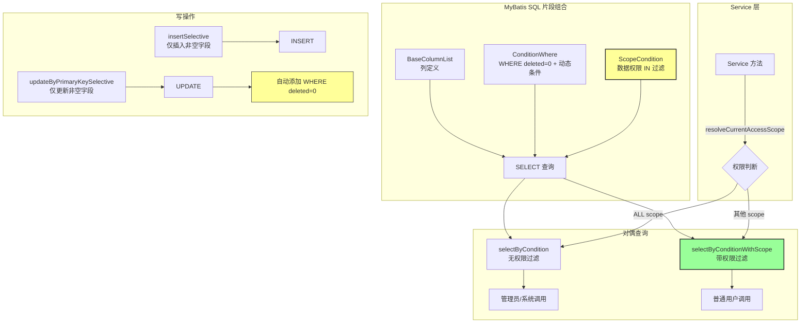

# MyBatis 工程化模式：SQL 片段复用与权限注入

> 通过 `<sql>` 片段的组合式复用，将数据权限、分页、排序等横切关注点从 Service 层下沉到 SQL 层，实现"写一次查询，自动获得权限过滤能力"。

---

## 架构总览



---

## 问题描述

MyBatis 的 XML Mapper 是一种"半手写 SQL"的方式——SQL 写在 XML 中，参数由 Java 传入。这种方式灵活性很高，但在工程化层面有几个常见问题：

1. **SQL 重复**：`WHERE deleted = 0`、分页 `LIMIT`、列名列表在每个查询中重复出现
2. **权限过滤遗漏**：新增查询接口时，开发者可能忘记加数据权限条件
3. **条件拼接冗长**：十几个 `<if>` 标签堆在一起，可读性差
4. **维护成本**：表结构变更时需要修改所有引用了该表的 SQL

本项目通过一套 `<sql>` 片段的组合模式解决了这些问题。

## 设计决策

### 决策 1：三段式 SQL 片段结构

每个 Mapper XML 定义三个标准 `<sql>` 片段：

```xml
<!-- 1. 列名列表：表结构变更时只改一处 -->
<sql id="BaseColumnList">
    id, biz_order_no, lead_id, patient_id, status, ...
</sql>

<!-- 2. 业务查询条件：通用的 WHERE 子句 -->
<sql id="ConditionWhere">
    where deleted = 0
    <if test="status != null and status != ''">
        and status = #{status}
    </if>
    ...
</sql>

<!-- 3. 数据权限条件：自动注入的行级过滤 -->
<sql id="ScopeCondition">
    <if test="authorizedDistributorIds != null and authorizedDistributorIds.size() > 0">
        and distributor_id in
        <foreach collection="authorizedDistributorIds" item="id" open="(" separator="," close=")">
            #{id}
        </foreach>
    </if>
    ...
</sql>
```

**为什么三段？** 因为这三个维度的变更频率和关注点完全不同：
- `BaseColumnList`：表结构变更时修改（低频）
- `ConditionWhere`：业务查询需求变更时修改（中频）
- `ScopeCondition`：权限规则变更时修改（低频，但影响全局）

### 决策 2：对偶查询方法（有权限 vs 无权限）

每个 Mapper 提供两套查询方法：

```xml
<!-- 无权限过滤：内部调用、管理员查询、定时任务 -->
<select id="selectByCondition" resultMap="BaseResultMap">
    select <include refid="BaseColumnList"/>
    from distribution_business_order
    <include refid="ConditionWhere"/>
    order by create_time desc, id desc
    limit #{offset}, #{limit}
</select>

<!-- 带权限过滤：面向用户的查询接口 -->
<select id="selectByConditionWithScope" resultMap="BaseResultMap">
    select <include refid="BaseColumnList"/>
    from distribution_business_order
    <include refid="ConditionWhere"/>
    <include refid="ScopeCondition"/>        ← 多了这一行
    order by create_time desc, id desc
    limit #{offset}, #{limit}
</select>
```

**为什么对偶而非统一？** 统一用带权限的版本会导致内部服务调用（如定时任务、数据迁移、跨服务调用）也需要传入权限参数，增加了不必要的复杂度。对偶设计让开发者**主动选择**是否需要权限过滤。

### 决策 3：`ConditionWhere` 以 `WHERE deleted = 0` 开头

所有 `ConditionWhere` 片段都以 `where deleted = 0` 开头，而不是在每个查询中单独写。

```xml
<sql id="ConditionWhere">
    where deleted = 0                         ← 软删除过滤，永远存在
    <if test="bizOrderNo != null and bizOrderNo != ''">
        and biz_order_no = #{bizOrderNo}      ← 业务条件，按需拼接
    </if>
    ...
</sql>
```

**好处**：
- 开发者不需要在每个查询中记得加 `deleted = 0`
- 如果未来需要改为物理删除或改用其他字段名，只改一处

### 决策 4：`ScopeCondition` 的双层过滤

权限条件不仅按 `distributor_id` 过滤渠道维度，还支持按 `member_id` 和 `owner_user_id` 过滤人员维度（用于 `SELF` 范围）。

```xml
<sql id="ScopeCondition">
    <!-- 渠道维度：OWN_DISTRIBUTOR / OWN_AND_CHILDREN -->
    <if test="authorizedDistributorIds != null and authorizedDistributorIds.size() > 0">
        and distributor_id in
        <foreach collection="authorizedDistributorIds" item="id" open="(" separator="," close=")">
            #{id}
        </foreach>
    </if>
    <!-- 人员维度：SELF -->
    <if test="authorizedMemberId != null or authorizedOwnerUserId != null">
        and (
        <if test="authorizedMemberId != null">
            member_id = #{authorizedMemberId}
        </if>
        <if test="authorizedMemberId != null and authorizedOwnerUserId != null">
            or
        </if>
        <if test="authorizedOwnerUserId != null">
            owner_user_id = #{authorizedOwnerUserId}
        </if>
        )
    </if>
</sql>
```

**两个维度的组合**：

| 数据范围 | authorizedDistributorIds | authorizedMemberId | authorizedOwnerUserId |
|---------|-------------------------|-------------------|----------------------|
| ALL | null | null | null |
| OWN_DISTRIBUTOR | [本渠道ID] | null | null |
| OWN_AND_CHILDREN | [本渠道ID, 子渠道1, 子渠道2, ...] | null | null |
| SELF | null | 当前成员ID | 当前用户ID |

### 决策 5：`insertSelective` / `updateByPrimaryKeySelective` 的部分更新

所有写操作使用 `insertSelective` 和 `updateByPrimaryKeySelective`，只操作非 null 字段：

```xml
<insert id="insertSelective" useGeneratedKeys="true" keyProperty="id">
    insert into distribution_business_order
    <trim prefix="(" suffix=")" suffixOverrides=",">
        <if test="bizOrderNo != null">biz_order_no,</if>
        <if test="leadId != null">lead_id,</if>
        <if test="status != null">status,</if>
        ...
    </trim>
    <trim prefix="values (" suffix=")" suffixOverrides=",">
        <if test="bizOrderNo != null">#{bizOrderNo},</if>
        <if test="leadId != null">#{leadId},</if>
        <if test="status != null">#{status},</if>
        ...
    </trim>
</insert>
```

**为什么不用全字段插入？**
- 创建时大部分字段有默认值（如 `create_time`、`deleted`），不需要显式插入
- 更新时只需要修改变化的字段，避免覆盖其他字段的并发修改
- 配合 `updateByPrimaryKeySelective`，可以实现"只更新非 null 字段"的语义

## 代码实现

### 完整的 Mapper XML 模板

以业务单（`distribution_business_order`）为例：

```xml
<mapper namespace="com.example.distribution.mapper.distribution.DistributionBusinessOrderMapper">

    <!-- ===== 1. 结果映射 ===== -->
    <resultMap id="BaseResultMap" type="...DistributionBusinessOrderEntity">
        <id column="id" property="id"/>
        <result column="biz_order_no" property="bizOrderNo"/>
        <result column="status" property="status"/>
        <!-- ... -->
    </resultMap>

    <!-- ===== 2. 可复用 SQL 片段 ===== -->
    <sql id="BaseColumnList">
        id, biz_order_no, lead_id, patient_id, status, signed_amount, ...
    </sql>

    <sql id="ConditionWhere">
        where deleted = 0
        <if test="bizOrderNo != null and bizOrderNo != ''">
            and biz_order_no = #{bizOrderNo}
        </if>
        <if test="status != null and status != ''">
            and status = #{status}
        </if>
        <!-- ... -->
    </sql>

    <sql id="ScopeCondition">
        <if test="authorizedDistributorIds != null and authorizedDistributorIds.size() > 0">
            and distributor_id in
            <foreach collection="authorizedDistributorIds" item="id" open="(" separator="," close=")">
                #{id}
            </foreach>
        </if>
        <if test="authorizedMemberId != null or authorizedOwnerUserId != null">
            and (
            <if test="authorizedMemberId != null">member_id = #{authorizedMemberId}</if>
            <if test="authorizedMemberId != null and authorizedOwnerUserId != null"> or </if>
            <if test="authorizedOwnerUserId != null">current_owner_user_id = #{authorizedOwnerUserId}</if>
            )
        </if>
    </sql>

    <!-- ===== 3. 查询方法（对偶） ===== -->
    <select id="countByCondition" resultType="java.lang.Long">
        select count(*) from distribution_business_order
        <include refid="ConditionWhere"/>
    </select>

    <select id="selectByCondition" resultMap="BaseResultMap">
        select <include refid="BaseColumnList"/>
        from distribution_business_order
        <include refid="ConditionWhere"/>
        order by create_time desc, id desc
        limit #{offset}, #{limit}
    </select>

    <select id="countByConditionWithScope" resultType="java.lang.Long">
        select count(*) from distribution_business_order
        <include refid="ConditionWhere"/>
        <include refid="ScopeCondition"/>
    </select>

    <select id="selectByConditionWithScope" resultMap="BaseResultMap">
        select <include refid="BaseColumnList"/>
        from distribution_business_order
        <include refid="ConditionWhere"/>
        <include refid="ScopeCondition"/>
        order by create_time desc, id desc
        limit #{offset}, #{limit}
    </select>

    <!-- ===== 4. 单条查询 ===== -->
    <select id="selectByPrimaryKey" resultMap="BaseResultMap">
        select <include refid="BaseColumnList"/>
        from distribution_business_order
        where id = #{id} and deleted = 0
    </select>

    <!-- ===== 5. 批量查询 ===== -->
    <select id="selectByIds" resultMap="BaseResultMap">
        select <include refid="BaseColumnList"/>
        from distribution_business_order
        where deleted = 0 and id in
        <foreach collection="ids" item="id" open="(" separator="," close=")">
            #{id}
        </foreach>
    </select>

    <!-- ===== 6. 写操作（部分更新） ===== -->
    <insert id="insertSelective" useGeneratedKeys="true" keyProperty="id">
        insert into distribution_business_order
        <trim prefix="(" suffix=")" suffixOverrides=",">
            <if test="bizOrderNo != null">biz_order_no,</if>
            <if test="status != null">status,</if>
            <!-- ... -->
        </trim>
        <trim prefix="values (" suffix=")" suffixOverrides=",">
            <if test="bizOrderNo != null">#{bizOrderNo},</if>
            <if test="status != null">#{status},</if>
            <!-- ... -->
        </trim>
    </insert>

    <update id="updateByPrimaryKeySelective">
        update distribution_business_order
        <set>
            <if test="status != null">status = #{status},</if>
            <if test="signedAmount != null">signed_amount = #{signedAmount},</if>
            <!-- ... -->
        </set>
        where id = #{id} and deleted = 0
    </update>
</mapper>
```

### Mapper 接口的对应签名

```java
public interface DistributionBusinessOrderMapper {
    // 无权限
    Long countByCondition(@Param("bizOrderNo") String bizOrderNo, ...);
    List<DistributionBusinessOrderEntity> selectByCondition(@Param("bizOrderNo") String bizOrderNo, ...,
                                                            @Param("offset") int offset, @Param("limit") int limit);
    // 带权限
    Long countByConditionWithScope(@Param("bizOrderNo") String bizOrderNo, ...,
                                   @Param("authorizedDistributorIds") List<Long> authorizedDistributorIds,
                                   @Param("authorizedMemberId") Long authorizedMemberId,
                                   @Param("authorizedOwnerUserId") Long authorizedOwnerUserId);
    List<DistributionBusinessOrderEntity> selectByConditionWithScope(@Param("bizOrderNo") String bizOrderNo, ...,
                                                                     @Param("authorizedDistributorIds") List<Long> authorizedDistributorIds,
                                                                     @Param("authorizedMemberId") Long authorizedMemberId,
                                                                     @Param("authorizedOwnerUserId") Long authorizedOwnerUserId,
                                                                     @Param("offset") int offset, @Param("limit") int limit);
    // 单条/批量
    DistributionBusinessOrderEntity selectByPrimaryKey(@Param("id") Long id);
    List<DistributionBusinessOrderEntity> selectByIds(@Param("ids") List<Long> ids);
    // 写操作
    int insertSelective(DistributionBusinessOrderEntity entity);
    int updateByPrimaryKeySelective(DistributionBusinessOrderEntity entity);
}
```

### Service 层的调用模式

```java
// 列表查询：解析权限 → 传参 → 自动过滤
public PageResponseDTO<DistributionBusinessOrderDTO> listBusinessOrders(...) {
    DistributionDataAccessScope scope = distributionDataPermissionService.resolveCurrentAccessScope();

    List<Long> authorizedDistributorIds = scope.isAllScope() || scope.isSelfScope()
        ? null : scope.getAuthorizedDistributorIds();
    Long authorizedMemberId = scope.isSelfScope() ? scope.getMemberId() : null;
    Long authorizedOwnerUserId = scope.isSelfScope() ? scope.getOperatorUserId() : null;

    long total = mapper.countByConditionWithScope(
        ..., authorizedDistributorIds, authorizedMemberId, authorizedOwnerUserId);
    List<...> entities = mapper.selectByConditionWithScope(
        ..., authorizedDistributorIds, authorizedMemberId, authorizedOwnerUserId, offset, limit);
}
```

## 适用场景

1. **任何使用 MyBatis 的中大型项目**：通过 SQL 片段复用减少重复
2. **需要行级数据权限的系统**：通过 `ScopeCondition` 统一注入
3. **多角色 B2B 系统**：同一张表需要多种查询视角（管理员 vs 普通用户）

### 不适用条件

- 使用 JPA/MyBatis-Plus 等自动生成 SQL 的框架（本模式依赖手写 XML）
- 表结构极其简单（如只有 3-5 个字段），片段复用的收益不大
- 不需要行级权限的系统

## 局限性

### 1. 参数签名冗长

带权限的查询方法需要 3 个额外参数（`authorizedDistributorIds`、`authorizedMemberId`、`authorizedOwnerUserId`），导致 Mapper 接口的方法签名很长。

**改进方向**：可以将权限参数封装为一个 `ScopeParams` 对象，但会增加一层间接性。

### 2. `ScopeCondition` 的一致性保障

每个 Mapper XML 都需要手写 `ScopeCondition` 片段。如果某个 Mapper 遗漏了某个条件（如 `SELF` 范围的 `owner_user_id`），会导致权限漏洞。

**改进方向**：
- 编写单元测试，验证每个 ScopeCondition 片段都包含所有必要的条件
- 或使用 MyBatis 拦截器在运行时自动注入权限条件

### 3. `OR` 条件的索引优化

`SELF` 范围生成的 `AND (member_id = ? OR owner_user_id = ?)` 条件可能导致索引失效。

**缓解方案**：确保 `member_id` 和 `owner_user_id` 都有独立索引，必要时用 `UNION` 替代 `OR`。

### 4. 批量查询的 IN 列表长度

`authorizedDistributorIds` 通过 `IN (...)` 注入。如果渠道树很深，列表可能很长（如 1000+ 个 ID）。MySQL 的 `IN` 列表有长度限制，且过长会影响查询性能。

**缓解方案**：
- 限制渠道树的最大深度
- 对 `authorizedDistributorIds` 做缓存
- 超长列表改用临时表或子查询

---

*本文档描述的模式在以下 Mapper XML 中实现：*
- *以及其他所有包含 `ScopeCondition` 片段的 Mapper XML*
