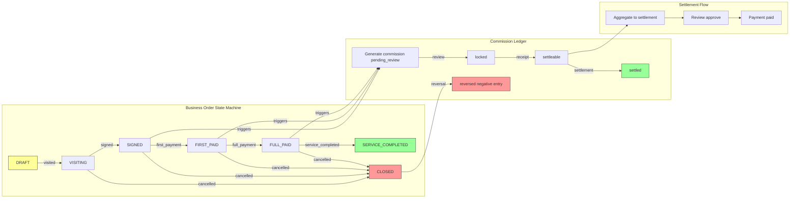

# Commission Pipeline: State-Machine-Driven Commission Flow

[中文](../../architecture/commission-pipeline.md) | English

> End-to-end fund flow from lead to settlement, driven by an event-driven state machine with rule snapshots and automatic reversal mechanisms, ensuring commission calculation traceability and consistency.

---

## Architecture Overview



---

## Problem Statement

The core of a distribution system is "how the money gets split." A typical commission flow chain is:

```
Salesperson John from Distributor A refers a patient → Patient signs contract → Patient makes payment → Service completed → Commission settled
```

This process involves state synchronization and fund calculation across multiple business entities:

1. **Rule Matching**: Different products, distributor levels, and trigger nodes correspond to different commission rules
2. **State Synchronization**: When business order status changes, lead stages and attribution states need synchronized updates
3. **Fund Consistency**: Cumulative receipts cannot exceed contract amount, commissions cannot exceed receipt amount
4. **Traceability**: Every commission must be traceable to "which event triggered it, calculated under what rules"
5. **Exception Handling**: When business orders are cancelled/closed, generated commissions need reversal

## Design Decisions

### Decision 1: Event-Driven, Not State-Driven

Business order status changes are driven by "events," not direct state modifications. Each status change creates an event record:

```java
// Not directly changing status:
businessOrder.setStatus("signed");

// But driving through events:
createEvent(businessOrderId, eventType: "signed", eventAmount: 50000, eventTime: now());
// → Auto-generates event record
// → Auto-updates business order status
// → Auto-generates commission ledger
// → Auto-updates lead stage
// → Auto-records audit log
```

**Reasons**:
- Events are immutable, naturally suitable for audit tracing
- Each event can carry context info like amount and time
- State at any point in time can be reconstructed through event replay

### Decision 2: Hardcoded State Machine, Not Configurable

Business order state transition rules are hardcoded in the `resolveAfterStatus()` method, not stored in database configuration.

```java
private String resolveAfterStatus(String currentStatus, String eventType) {
    if (DRAFT.equals(currentStatus)) {
        if (VISITED.equals(eventType)) return VISITING;
        if (SIGNED.equals(eventType)) return SIGNED;
        if (CANCELLED.equals(eventType)) return CANCELLED;
    }
    if (VISITING.equals(currentStatus)) {
        if (SIGNED.equals(eventType)) return SIGNED;
        if (CANCELLED.equals(eventType)) return CANCELLED;
    }
    // ... more state transition rules
    throw new BizException("Current business order status does not support this event");
}
```

**Why hardcode?**
- State transition rules are core business logic with low change frequency
- Hardcoding allows compile-time error detection
- Each transition may have additional side effects (e.g., amount validation, timestamp updates) that are hard to express in generic configuration
- If configurability is needed later, this method can be replaced with a state machine engine (e.g., Spring StateMachine)

### Decision 3: Rule Snapshots, Not References

When generating commission ledger entries, the rule information at that time is saved as a JSON snapshot, not just a rule ID.

```json
{
  "policyId": 101,
  "policyName": "Gene Testing Distribution Policy v2.0",
  "policyVersion": "v2.0.0",
  "ruleId": 55,
  "triggerNode": "first_payment",
  "ruleType": "rate",
  "commissionRate": 8.00,
  "fixedAmount": null,
  "channelLevelCode": "L1",
  "distributorLevelCode": "L1",
  "eventNo": "DBOE20260615143022-7821",
  "eventType": "first_payment"
}
```

**Why snapshots over references?**
- Commission policies change (e.g., from 8% to 10%), but generated commissions should be calculated under the rules at that time
- Audit needs to know "under what rules was this commission calculated" without looking up historical versions
- Dispute arbitration during settlement relies on complete rule context

### Decision 4: Reversal, Not Deletion

When business orders are cancelled/closed, generated commission ledger entries are not deleted. Instead, negative "reversal entries" are created.

```java
// Original entry: +5000
// After business order cancelled, generate reversal entry: -5000
DistributionCommissionLedgerEntity reverseEntity = new DistributionCommissionLedgerEntity();
reverseEntity.setCommissionAmount(ledger.getCommissionAmount().negate());  // Negate
reverseEntity.setReverseLedgerId(ledger.getId());  // Link to original entry
reverseEntity.setBizEventNo(eventNo + "-R-" + ledger.getId());  // Reversal event number
```

**Why reversal over deletion?**
- Already settled (paid) commissions cannot be directly deleted; negative entries are needed for offset in the next period
- Preserves the complete fund flow chain for reconciliation and auditing
- Follows the accounting convention of "red-letter reversal"

### Decision 5: Two-Phase Reversal (Settled vs Unsettled)

Reversal logic handles two cases based on the original entry's status:

| Original Entry Status | Reversal Method | Description |
|----------------------|-----------------|-------------|
| `PENDING_REVIEW` / `LOCKED` | Directly mark as `REVERSED` | Not settled, directly voided |
| `SETTLED` | Generate negative entry + update settlement | Already paid, needs offset in next period |

```java
if (SETTLED.equals(ledger.getStatus())) {
    // Already settled: generate negative offset entry for next period
    reverseEntity.setStatus(SETTLEABLE);
    markPaidSettlementReversed(ledger, reverseEntity, operatorUserId);
} else {
    // Not settled: directly mark as reversed
    reverseEntity.setStatus(REVERSED);
    updateLedgerStatus(ledger.getId(), ..., REVERSED);
}
```

## Code Implementation

### Full Chain Data Flow

```
Lead
  │
  │ Linked when creating business order
  ▼
Business Order  ◄─── Business Order Event
  │                        │
  │ Status progression     │ Triggers
  │                        ▼
  │                   Commission Ledger
  │                        │
  │                        │ Record receipt
  │                        ▼
  │                   Settlement
  │                        │
  │                        │ Review → Payment
  │                        ▼
  └───────────────────► Attribution synchronized update
```

### State Machine Panorama

#### Business Order State Transitions

```
                  ┌─────────────────────────────────────────────┐
                  │                                             │
                  ▼                                             │
  ┌───────┐   visited   ┌─────────┐   signed   ┌──────────┐   │
  │ DRAFT │────────────►│VISITING │───────────►│  SIGNED  │   │
  └───────┘             └─────────┘            └──────────┘   │
      │                     │                     │            │
      │ signed              │ signed              │ first_payment
      ├─────────────────────┼─────────────────────┤            │
      │                     │                     ▼            │
      │                     │               ┌───────────┐      │
      │                     │               │FIRST_PAID │      │
      │                     │               └───────────┘      │
      │                     │                     │            │
      │ cancelled           │ cancelled           │ full_payment
      ▼                     ▼                     ▼            │
  ┌───────────┐        ┌───────────┐        ┌──────────┐      │
  │CANCELLED  │        │CANCELLED  │        │ FULL_PAID│      │
  └───────────┘        └───────────┘        └──────────┘      │
                                                   │            │
                                                   │ service_completed
                                                   ▼            │
                                             ┌─────────────┐   │
                                             │  SERVICE_    │   │
                                             │  COMPLETED   │   │
                                             └─────────────┘   │
                                                   │            │
                                                   │ closed     │
                                                   ▼            │
                                             ┌──────────┐      │
                                             │  CLOSED  │──────┘
                                             └──────────┘
```

#### Commission Ledger State Transitions

```
  ┌──────────────────┐
  │  PENDING_REVIEW  │ (Auto-generated)
  └──────────────────┘
         │
         │ lock (Review approved)
         ▼
  ┌──────────────────┐
  │     LOCKED       │
  └──────────────────┘
         │
         │ record_receipt (Record payment receipt)
         ▼
  ┌──────────────────┐
  │   SETTLEABLE     │─────► Auto-generate settlement
  └──────────────────┘
         │
         │ (After linked to settlement)
         ▼
  ┌──────────────────┐
  │     SETTLED      │ (Settled/Paid)
  └──────────────────┘

  ┌──────────────────┐
  │     REVERSED     │ (Unsettled reversal)
  └──────────────────┘

  ┌──────────────────┐
  │     VOIDED       │ (Voided)
  └──────────────────┘
```

### Core Code: Auto-Generate Commission

When a business order event occurs, commission calculation is automatically triggered:

```java
// In DistributionBusinessOrderServiceImpl.createEvent():
distributionCommissionService.generateForBusinessOrderEvent(currentOrder, eventEntity);
```

```java
// DistributionCommissionService.java

public void generateForBusinessOrderEvent(DistributionBusinessOrderEntity businessOrder,
                                          DistributionBusinessOrderEventEntity event) {
    // 1. Reversal scenario: business order cancelled/closed
    if (CANCELLED.equals(event.getEventType()) || CLOSED.equals(event.getEventType())) {
        reverseForBusinessOrderEvent(businessOrder, event);
        return;
    }

    // 2. Idempotency check: don't generate duplicate commissions for the same event
    if (distributionCommissionLedgerMapper.selectByBizEventNo(event.getEventNo()) != null) {
        return;
    }

    // 3. Map trigger node
    String triggerNode = resolveTriggerNode(event.getEventType());
    // SIGNED → "signed", FIRST_PAYMENT → "first_payment", FULL_PAYMENT → "full_payment"

    // 4. Find matching commission rule
    ResolvedCommission resolved = resolveCommission(businessOrder, event, distributor, triggerNode);

    // 5. Generate commission ledger entry
    DistributionCommissionLedgerEntity entity = new DistributionCommissionLedgerEntity();
    entity.setCommissionAmount(resolved.commissionAmount);
    entity.setCommissionRuleSnapshot(writeRuleSnapshot(policy, rule, distributor, event));
    entity.setStatus(PENDING_REVIEW);
    distributionCommissionLedgerMapper.insertSelective(entity);

    // 6. Record audit log
    distributionAuditLogService.record(COMMISSION, entity.getId(), "create", ...);
}
```

### Core Code: Rule Matching

```java
private ResolvedCommission resolveCommission(DistributionBusinessOrderEntity businessOrder,
                                             DistributionBusinessOrderEventEntity event,
                                             DistributionDistributorEntity distributor,
                                             String triggerNode) {
    // 1. Find all active policies for this product
    List<DistributionProductPolicyEntity> policies =
        distributionProductPolicyMapper.selectActiveByProductId(
            businessOrder.getProductId(), event.getEventTime());

    // 2. Iterate policies, find first matching rule
    for (DistributionProductPolicyEntity policy : policies) {
        List<DistributionProductPolicyRuleEntity> rules =
            distributionProductPolicyRuleMapper.selectByPolicyId(policy.getId());

        // 3. Filter by trigger node + distributor level
        DistributionProductPolicyRuleEntity rule =
            pickRule(rules, triggerNode, distributor.getLevelCode());

        // 4. Calculate commission amount
        BigDecimal amount = calculateCommissionAmount(rule, businessOrder, event);
        if (amount != null && amount.compareTo(BigDecimal.ZERO) > 0) {
            return new ResolvedCommission(policy, rule, amount);
        }
    }
    return null;  // No matching rule, no commission generated
}

private BigDecimal calculateCommissionAmount(DistributionProductPolicyRuleEntity rule,
                                             DistributionBusinessOrderEntity businessOrder,
                                             DistributionBusinessOrderEventEntity event) {
    // Fixed amount mode
    if (FIXED.equals(rule.getRuleType())) {
        return rule.getFixedAmount();
    }
    // Rate mode: base amount × commission rate
    if (RATE.equals(rule.getRuleType())) {
        BigDecimal baseAmount = resolveBaseAmount(businessOrder, event);
        return baseAmount.multiply(rule.getCommissionRate())
            .divide(new BigDecimal("100"), 2, RoundingMode.HALF_UP);
    }
    return null;
}
```

### Core Code: Reversal Mechanism

```java
private void reverseForBusinessOrderEvent(DistributionBusinessOrderEntity businessOrder,
                                          DistributionBusinessOrderEventEntity event) {
    // 1. Find all commission ledger entries for this business order
    List<DistributionCommissionLedgerEntity> ledgers =
        distributionCommissionLedgerMapper.selectByBizOrderId(businessOrder.getId());

    for (DistributionCommissionLedgerEntity ledger : ledgers) {
        // 2. Skip already reversed entries
        if (!shouldReverseLedger(ledger)) continue;

        // 3. Idempotency check
        String reverseBizEventNo = event.getEventNo() + "-R-" + ledger.getId();
        if (distributionCommissionLedgerMapper.selectByBizEventNo(reverseBizEventNo) != null) continue;

        // 4. Generate negative reversal entry
        DistributionCommissionLedgerEntity reverseEntity = new DistributionCommissionLedgerEntity();
        reverseEntity.setCommissionAmount(ledger.getCommissionAmount().negate());
        reverseEntity.setReverseLedgerId(ledger.getId());
        reverseEntity.setBizEventNo(reverseBizEventNo);

        // 5. Determine reversal method based on original entry status
        if (SETTLED.equals(ledger.getStatus())) {
            // Already paid: generate negative offset entry, update settlement
            reverseEntity.setStatus(SETTLEABLE);
            markPaidSettlementReversed(ledger, reverseEntity, operatorUserId);
        } else {
            // Not paid: directly mark as reversed
            reverseEntity.setStatus(REVERSED);
            updateLedgerStatus(ledger.getId(), ..., REVERSED);
        }
    }
}
```

### Core Code: Side-Effect Synchronization During Status Progression

When business order events progress, besides updating the business order status, multiple synchronized operations are triggered:

```java
// In DistributionBusinessOrderServiceImpl.createEvent():

// 1. Update business order status and timestamps
applyEventMutation(update, existing, eventType, request);

// 2. Auto-generate commission ledger
distributionCommissionService.generateForBusinessOrderEvent(currentOrder, eventEntity);

// 3. Auto-delete attribution when business order is cancelled/closed
deleteAttributionWhenBusinessOrderClosed(currentOrder, eventType, operatorUserId);

// 4. Synchronize lead stage update
updateLeadStageWhenBusinessOrderStatusChanged(currentOrder, afterStatus, operatorUserId);

// 5. Auto-create lead follow-up record
createLeadFollowUpForBusinessOrderEvent(currentOrder, eventEntity, operatorUserId);

// 6. Record audit log
distributionAuditLogService.record(BUSINESS_ORDER, id, "event_" + eventType, ...);
```

### Settlement Lifecycle

```
Commission Ledger SETTLEABLE
       │
       │ createSettlement (Batch aggregate by distributor + time period)
       ▼
  ┌──────────┐   approve   ┌──────────┐   pay   ┌──────────┐
  │ PENDING  │────────────►│ APPROVED │────────►│   PAID   │
  └──────────┘             └──────────┘         └──────────┘
       │
       │ reject
       ▼
  ┌──────────┐
  │ REJECTED │
  └──────────┘
```

## Applicable Scenarios

1. **Distribution Commission Systems**: Channel commission calculation, review, and settlement
2. **Order Profit-Sharing Systems**: Multi-party revenue distribution
3. **Performance Commission Systems**: Tiered sales commission calculation and disbursement
4. **Any fund flow scenario involving "Event → Rule Matching → Amount Calculation → Review → Payment"**

### Prerequisites

- Commission rules can be configured at runtime (Product × Distributor Level × Trigger Node)
- Fund flow requires a complete audit trail
- Must support "reversal after payment" scenarios

### Not Applicable When

- Commission rules are extremely complex (e.g., multi-level profit sharing, team fission), which may need a dedicated rule engine
- Real-time settlement (e.g., instant per-transaction settlement); this pattern favors batch settlement
- Direct integration with external payment channels

## Limitations

### 1. Hardcoded State Machine Maintenance Cost

All state transition rules are concentrated in the `resolveAfterStatus()` method. As business order statuses and event types increase, this method becomes long and error-prone.

**Improvement Direction**:
- Introduce a state transition matrix (2D array or Map)
- Or use the Spring StateMachine framework

### 2. N+1 Query in Commission Calculation

In `resolveCommission()`, policies are queried first, then rules are queried per policy — an N+1 query problem.

**Improvement Direction**:
- Batch query: fetch all policies and their rules for a product in one go
- Caching: local cache for active commission policies

### 3. Reversal Cascade Complexity

Reversing already-settled commissions requires updating: original entry status → reversal entry → settlement `reversedAmount` → settlement `actualAmount` → settlement detail status. This cascade operation, while in a single transaction, has complex logic and is prone to edge case oversights.

### 4. Settlement Granularity

In the current implementation, recording a receipt auto-generates a "single-entry settlement," but batch creation by distributor + time period is also supported. The coexistence of both approaches increases comprehension cost.

**Recommendation**: Unify to batch settlement mode, removing the auto-generation of single-entry settlements.

### 5. Missing Commission Estimation

Currently, commissions are only calculated after events actually occur. There's no estimation capability for "if a customer signs for 50,000, how much commission does the salesperson get."

**Improvement Direction**: Add an `estimateCommission(productId, amount, distributorLevel)` endpoint that reuses rule matching logic without persisting.

---

*The pattern described in this document is implemented in the following code:*
- *Business order service: `service/distribution/impl/DistributionBusinessOrderServiceImpl.java`*
- *Commission service: `service/distribution/impl/DistributionCommissionServiceImpl.java`*
- *Settlement service: `service/distribution/impl/DistributionSettlementServiceImpl.java`*
- *Trigger node enum: `enums/distribution/DistributionTriggerNode.java`*
- *Rule type enum: `enums/distribution/DistributionRuleType.java`*
- *Commission mode enum: `enums/distribution/DistributionCommissionMode.java`*
