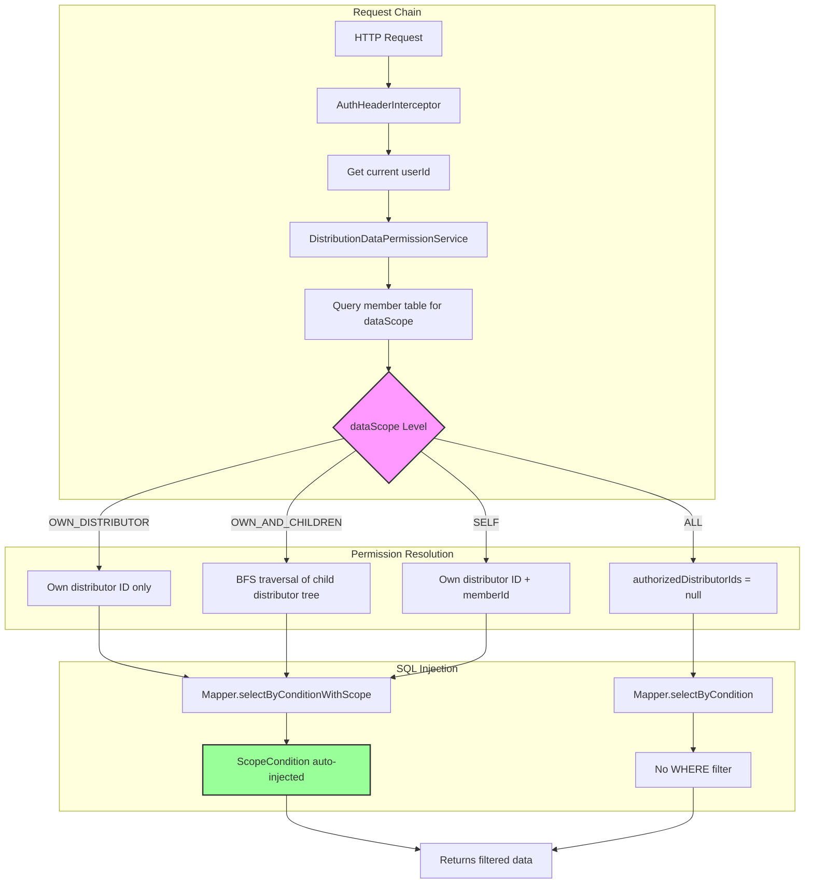

# Scoped Data Access: Row-Level Data Permission Model

[中文](../../architecture/data-permission-model.md) | English

> Role-based data scope control, pushing permission enforcement down to the SQL layer for zero business code intrusion in row-level data filtering.

---

## Architecture Overview



---

## Problem Statement

In B2B management systems, users with different roles have strict requirements for data visibility scope. Using a distribution system as an example:

| Role | Data They Should See |
|------|---------------------|
| Super Admin | All leads, business orders, and commissions across all distributors |
| Distribution Manager | Data for their own distributor and child distributors |
| Salesperson | Only leads and business orders they are responsible for |
| Finance | Financial data across all distributors, but cannot see lead details |

The traditional approach is to manually append `WHERE` conditions in each query endpoint. This has three problems:

1. **Omission Risk**: New query endpoints can easily forget to add permission filtering
2. **Code Duplication**: The same permission filtering logic is scattered across dozens of Service methods
3. **Maintenance Cost**: When permission rules change, all related endpoints need modification

## Design Decisions

### Decision 1: Permission Info Stored on Member Table, Not User Table

The `data_scope` and `role_code` fields are on the `distribution_distributor_member` table, not the `admin_user` table.

```
admin_user (System User)
    └── distribution_distributor_member (Distribution Member) ← data_scope, role_code here
            └── distribution_distributor (Belonging Distributor)
```

**Reason**: The same system user may have different roles in different distributors. For example, John is a salesperson (`SELF`) in Distributor A, but a manager (`OWN_DISTRIBUTOR`) in Distributor B. If stored on the user table, this multi-distributor multi-role scenario cannot be expressed.

### Decision 2: 4 Enum Values Cover All Scenarios

```java
public enum DistributionDataScope {
    ALL("ALL"),                        // All data
    OWN_DISTRIBUTOR("OWN_DISTRIBUTOR"), // Own distributor data
    OWN_AND_CHILDREN("OWN_AND_CHILDREN"), // Own + child distributor data
    SELF("SELF");                       // Own data only
}
```

**Why not make it configurable to any level?** Because 4 levels already cover 95% of B2B scenarios. Excessive flexibility increases comprehension cost and testing complexity.

### Decision 3: Permission Resolution Cached as Immutable Object

`DistributionDataAccessScope` is an immutable value object. After resolution, it's passed via method parameters, not stored in ThreadLocal.

```java
public static final class DistributionDataAccessScope {
    private final Long operatorUserId;
    private final Long memberId;
    private final Long distributorId;
    private final String roleCode;
    private final String dataScope;
    private final List<Long> authorizedDistributorIds;  // Immutable List

    // No setters — all fields set via constructor
}
```

**Why not use ThreadLocal?** While more convenient, it introduces three problems:
- Must be manually cleaned up after request ends, otherwise memory leaks
- Context unavailable in async threads
- Unit tests need extra setup/teardown

### Decision 4: Filter at SQL Layer, Not Java Layer

Permission conditions are injected into SQL via MyBatis `<sql>` fragments, rather than filtering in Java after querying full data.

```xml
<sql id="ScopeCondition">
    <if test="authorizedDistributorIds != null and authorizedDistributorIds.size() > 0">
        and distributor_id in
        <foreach collection="authorizedDistributorIds" item="id" open="(" separator="," close=")">
            #{id}
        </foreach>
    </if>
    <if test="authorizedMemberId != null or authorizedOwnerUserId != null">
        and (
        <if test="authorizedMemberId != null">
            member_id = #{authorizedMemberId}
        </if>
        <if test="authorizedMemberId != null and authorizedOwnerUserId != null">
            or
        </if>
        <if test="authorizedOwnerUserId != null">
            owner_user_id = #{authorizedOwnerUserId}
        </if>
        )
    </if>
</sql>
```

**Why at the SQL layer?**
- **Performance**: Filter at the database level before returning, avoiding transmission of unauthorized data
- **Security**: Java-layer filtering can be missed; SQL-layer uses unified `<include>` for forced injection
- **Simplicity**: Service layer doesn't need to care about filtering logic

## Code Implementation

### Overall Architecture

```
┌─────────────────────────────────────────────────────────────────┐
│                        Controller Layer                          │
│  @SessionAuth → Parse Token → ThreadLocal userId                │
└──────────────────────────────┬──────────────────────────────────┘
                               │
┌──────────────────────────────▼──────────────────────────────────┐
│                        Service Layer                             │
│                                                                  │
│  1. resolveCurrentAccessScope()                                  │
│     → Query member table → Read roleCode + dataScope             │
│     → resolveAuthorizedDistributorIds()                          │
│     → Return DistributionDataAccessScope (immutable object)      │
│                                                                  │
│  2. checkAccessPermission(distributorId, memberId, ownerUserId)  │
│     → ALL: Pass through                                          │
│     → SELF: Check if memberId or ownerUserId matches             │
│     → OWN_DISTRIBUTOR / OWN_AND_CHILDREN:                       │
│       Check if distributorId is in authorizedDistributorIds      │
└──────────────────────────────┬──────────────────────────────────┘
                               │
┌──────────────────────────────▼──────────────────────────────────┐
│                        Mapper Layer                              │
│                                                                  │
│  <select id="selectByConditionWithScope">                        │
│    SELECT ... FROM table                                         │
│    <include refid="ConditionWhere"/>    ← Business filter        │
│    <include refid="ScopeCondition"/>    ← Permission filter      │
│  </select>                                                       │
└─────────────────────────────────────────────────────────────────┘
```

### Core Code: Permission Resolution

```java
// DistributionDataPermissionService.java

public DistributionDataAccessScope resolveCurrentAccessScope() {
    // 1. Get current operator
    Long operatorUserId = distributionOperatorService.getCurrentOperatorUserId();
    DistributionDistributorMemberEntity currentMember =
        distributionDistributorMemberMapper.selectByUserId(operatorUserId);

    // 2. Validate role and data scope
    String roleCode = currentMember.getRoleCode();
    String dataScope = currentMember.getDataScope();

    // 3. Resolve accessible distributor ID list
    List<Long> authorizedDistributorIds =
        resolveAuthorizedDistributorIds(currentMember.getDistributorId(), dataScope);

    // 4. Build immutable permission scope object
    return new DistributionDataAccessScope(
        operatorUserId, currentMember.getId(),
        currentMember.getDistributorId(), roleCode,
        dataScope, authorizedDistributorIds
    );
}
```

### Core Code: Distributor Tree Recursive Traversal

```java
private List<Long> resolveAuthorizedDistributorIds(Long distributorId, String dataScope) {
    // ALL: return null to indicate no restriction
    if (DistributionDataScope.ALL.getCode().equals(dataScope)) {
        return null;
    }
    // SELF: no distributor ID list needed (filtered by memberId)
    if (distributorId == null) {
        return Collections.emptyList();
    }

    LinkedHashSet<Long> authorizedIds = new LinkedHashSet<>();
    authorizedIds.add(distributorId);

    // OWN_DISTRIBUTOR: return only self
    if (!DistributionDataScope.OWN_AND_CHILDREN.getCode().equals(dataScope)) {
        return new ArrayList<>(authorizedIds);
    }

    // OWN_AND_CHILDREN: BFS traversal of child distributor tree
    List<Long> parentIds = Collections.singletonList(distributorId);
    while (!parentIds.isEmpty()) {
        List<DistributionDistributorEntity> children =
            distributionDistributorMapper.selectByParentIds(parentIds);
        if (children == null || children.isEmpty()) break;

        List<Long> nextParentIds = new ArrayList<>();
        for (DistributionDistributorEntity child : children) {
            if (authorizedIds.add(child.getId())) {  // Deduplicate
                nextParentIds.add(child.getId());
            }
        }
        parentIds = nextParentIds;
    }
    return new ArrayList<>(authorizedIds);
}
```

### Core Code: Permission Check

```java
public void checkAccessPermission(Long distributorId, Long memberId, Long ownerUserId) {
    DistributionDataAccessScope scope = resolveCurrentAccessScope();

    // ALL: pass through
    if (scope.isAllScope()) return;

    // SELF: can only access own data
    if (scope.isSelfScope()) {
        boolean matched = false;
        if (memberId != null && scope.getMemberId().equals(memberId)) matched = true;
        if (ownerUserId != null && scope.getOperatorUserId().equals(ownerUserId)) matched = true;
        if (!matched) throw new BizException("No access to this data", ...);
        return;
    }

    // OWN_DISTRIBUTOR / OWN_AND_CHILDREN: check if distributor is in authorized range
    List<Long> authorizedIds = scope.getAuthorizedDistributorIds();
    if (authorizedIds == null || authorizedIds.isEmpty()
        || !authorizedIds.contains(distributorId)) {
        throw new BizException("No access to this data", ...);
    }
}
```

### Usage: Two Service-Layer Patterns

**Pattern 1: List Query — Pass ScopeCondition Parameters**

```java
// DistributionBusinessOrderServiceImpl.java

public PageResponseDTO<DistributionBusinessOrderDTO> listBusinessOrders(...) {
    DistributionDataAccessScope accessScope =
        distributionDataPermissionService.resolveCurrentAccessScope();

    // Determine SQL parameters based on data scope
    List<Long> authorizedDistributorIds = accessScope.isAllScope() || accessScope.isSelfScope()
        ? null : accessScope.getAuthorizedDistributorIds();
    Long authorizedMemberId = accessScope.isSelfScope() ? accessScope.getMemberId() : null;
    Long authorizedOwnerUserId = accessScope.isSelfScope() ? accessScope.getOperatorUserId() : null;

    // Query with auto-injected permission conditions
    long total = distributionBusinessOrderMapper.countByConditionWithScope(
        ..., authorizedDistributorIds, authorizedMemberId, authorizedOwnerUserId);
    List<...> entities = distributionBusinessOrderMapper.selectByConditionWithScope(
        ..., authorizedDistributorIds, authorizedMemberId, authorizedOwnerUserId, offset, limit);
}
```

**Pattern 2: Detail Query — Check Access for Single Record**

```java
// Get and validate single record
DistributionBusinessOrderEntity entity = getBusinessOrderEntity(id);
distributionDataPermissionService.checkAccessPermission(
    entity.getDistributorId(), entity.getMemberId(), entity.getCurrentOwnerUserId());
```

### Mapper XML Dual Design

Each permission-controlled Mapper provides two sets of query methods:

| Method | Purpose | Has Permission Filter |
|--------|---------|----------------------|
| `selectByCondition` | Internal calls, admin queries | ❌ |
| `selectByConditionWithScope` | Regular user queries | ✅ |
| `countByCondition` | Internal counting | ❌ |
| `countByConditionWithScope` | Regular user counting | ✅ |

This dual design ensures internal service calls (e.g., scheduled tasks, data migration) can bypass permission restrictions, while user-facing endpoints enforce permission filtering.

## Applicable Scenarios

This pattern applies to:

1. **Multi-tenant SaaS Systems**: Different tenants can only see their own data
2. **Group-Branch-Department Hierarchies**: Higher levels can see lower levels' data
3. **CRM / Distribution Systems**: Salespeople can only see their assigned customers
4. **Any system requiring "role-based row-level data visibility control"**

### Prerequisites

- Data has clear ownership relationships (belongs to an organization/department/person)
- Permission dimensions are relatively fixed (e.g., organizational hierarchy, personnel attribution)
- High query frequency, requiring efficient database-level filtering

### Not Applicable When

- Permission dimensions are extremely flexible (e.g., ABAC-based arbitrary attribute combinations)
- Data has no clear ownership (e.g., public knowledge base)
- Column-level permission control is needed (this pattern only addresses row-level)

## Limitations

### 1. Distributor Tree Depth Impacts Performance

`OWN_AND_CHILDREN` traverses child distributor trees via recursive SQL queries. If the distributor hierarchy is deep (e.g., 5+ levels) with many distributors per level, the generated `IN (...)` list can be very long.

**Mitigation**:
- Limit maximum distributor tree depth (business-level constraint)
- Cache `authorizedDistributorIds` (e.g., Redis with 5-minute TTL)
- Consider using a `path` field (e.g., `1/5/23/`) with `LIKE '1/5/%'` instead of recursive queries

### 2. SELF Scope Query Performance

`SELF` scope needs to check both `member_id` and `owner_user_id` fields, generating an `OR` SQL condition:

```sql
AND (member_id = #{authorizedMemberId} OR owner_user_id = #{authorizedOwnerUserId})
```

If the table has large data volume, this `OR` condition may cause index inefficiency.

**Mitigation**:
- Ensure both `member_id` and `owner_user_id` have independent indexes
- If performance is still insufficient, consider splitting into two queries and merging results

### 3. Permission Change Propagation Delay

Permission info is stored in the `distribution_distributor_member` table and takes effect immediately after modification. However, if caching is used (e.g., Redis cache for `authorizedDistributorIds`), the cache must be actively cleared when member permissions change.

### 4. No Column-Level Permissions

This pattern only addresses "which rows are visible," not "some fields are invisible to certain roles." Column-level permissions (e.g., salespeople can't see cost prices) require additional implementation.

### 5. Cross-Distributor Data Ownership

When data involves multiple distributors (e.g., a lead from Distributor A is transferred to Distributor B), `distributor_id` can only record one owner. The current design partially addresses this with `owner_user_id`, but complex multi-distributor collaboration scenarios may need a more granular permission model.

---

## Reusable Implementation

The "data permissions at the SQL layer" pattern described in this document has been abstracted into an independent Spring Boot Starter library, ready to import and use:

📦 **[spring-data-permission-starter](https://github.com/StevenTsai/spring-data-permission-starter)**

| Comparison | This Document (distribution-starter) | Starter Library |
|-----------|--------------------------------------|-----------------|
| Purpose | Teaching example, showing full implementation | Production-ready reusable library |
| Data Scopes | 4 levels (ALL / OWN_DISTRIBUTOR / OWN_AND_CHILDREN / SELF) | 4 standard scopes + extension points |
| Permission Context | `DistributionDataAccessScope` immutable object | `DataPermissionContext` + Builder |
| SQL Injection | Manual parameter passing + `<include refid="ScopeCondition"/>` | `DataPermissionHelper` auto-fills parameters |
| Usage | Reference code and implement yourself | Maven dependency, ready to use |

> If you want to use data permission capabilities directly in your project, the Starter library is recommended. If you want to understand "why it's designed this way," this document provides the complete design rationale.

---

*The pattern described in this document is implemented in the following code:*
- *Core logic: `service/distribution/impl/DistributionDataPermissionService.java`*
- *Data scope enum: `enums/distribution/DistributionDataScope.java`*
- *Role enum: `enums/distribution/DistributionRoleCode.java`*
- *SQL fragments: `ScopeCondition` in each Mapper XML*
